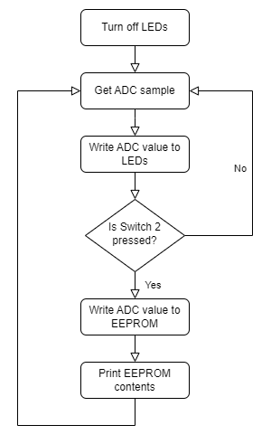

# INTRODUCTION

The following labs in this demo code project are designed for Microchip’s Curiosity High Pin Count (HPC) Development board. This development board supports Microchip's 28 and 40-pin 8-bit PIC® MCUs. This MPLAB X project contains several lab exercises that demonstrate a large number of basic capabilities of PIC® devices and can also be used to test the condition of the board. Each lab contains a brief description of the lab and discussions to make you become easily acquainted with the different peripherals and registers of PIC® MCUs. These labs also make use of the MPLAB Code Configurator (MCC), an easy-to-use plugin tool for MPLAB X IDE. MCC can be used to setup the peripherals and also generates drivers which can be used in the application code. All labs are written in C language and are compatible with the latest XC8 compilers.

##### Curiosity High Pin Count (HPC) Development Board:
 

## Software Used
  - [MPLAB® X IDE 6.20 or newer](http://www.microchip.com/mplab/mplab-x-ide)
  - [MPLAB® XC8 3.00 compiler or newer](http://www.microchip.com/mplab/compilers)
  - [MPLAB® Code Configurator (MCC) 5.7.1 or newer](https://www.microchip.com/mplab/mplab-code-configurator)
  - [Microchip PIC18F-Q Series Device Support 1.26.442 or newer](https://packs.download.microchip.com/)

## Hardware Used
- [PIC18F47Q10 Microcontroller](https://www.microchip.com/wwwproducts/en/PIC18F47Q10)
- [Curiosity High Pin Count (HPC) Development Board (DM164136)](https://www.microchip.com/developmenttools/ProductDetails/PartNO/DM164136)     

## Labs
The lab descriptions in this file are presented in the same order as they appear in the programmed project. Switch through the labs by pressing the S1 button on the board.

- Lab 1: Hello World (Turn on an LED)  
- Lab 2: Blink  
- Lab 3: Rotate (Moving the Light Across LEDs)  
- Lab 4: Analog-to-Digital Conversion (ADC)  
- Lab 5: Variable Speed Rotate  
- Lab 6: Pulse-Width Modulation (PWM)  
- Lab 7: Timers  
- Lab 8: Interrupts  
- Lab 9: Wake-up From Sleep Using Watchdog Timer  
- Lab 10: EEPROM  

## Inputs and Display
- Push Button Switch S1 is connected to the PIC MCUs RB4 pin and used to switch to the next lab. Each switch is debounced using a Configurable Logic Cell (CLC) and Timer resource.  
- A 10k potentiometer is connected to the RA0 pin and used as an analog input  
- The Curiosity HPC Development board has four LEDs (D2 through D5) that are connected to I/O ports RA4 through RA7, respectively. These LEDs are used to display the output of the different labs.  

### <u>Lab 1: Hello World</u>
#### Introduction
This lab shows how to turn on an LED.

#### Hardware Effects
LED D2 lights up and stays lit.

#### Summary
The LEDs are connected to the Input/Output (I/O) pins. First, the I/O pin must be configured as output. In this case, when one of these pins is driven high (LED_D2 = 1), the LED will turn on. These two logic levels are derived from the power pins of the PIC MCU. Since the PIC's power pin (VDD) is connected to 5V or 3.3V and the source (VSS) to ground (0V), a logic level of '`1`' is equivalent to 5V or 3.3V, and a logic level of '`0`' is 0V.

### <u>Lab 2: Blink</u>
#### Introduction
This lab shows how to blink an LED.

#### Hardware Effects
LED D2 blinks at a rate of approximately 1.5 seconds.

#### Summary
One way to create a delay is to spend time decrementing a variable in software. In assembly, the timing can be accurately programmed since the user will have direct control over the code execution. In C, the compiler takes the source code and compiles it into assembly before creating a hex code to program to the PIC MCU. Consequently, it is difficult to anticipate the number of instructions needed to execute a line in C. For more accurate timing in C, this lab uses the MCUs Timer1 (TMR1) module to produce the desired delay. Timer1 is discussed in Lab 7: Timers.

### <u>Lab 3: Rotate</u>
#### Introduction
This lab is built on Labs 1 and 2, which showed how to light up an LED and then make it blink using loops. This lab incorporates four on-board LEDs (D2, D3, D4 and D5) and the program will light up each LED in turn.

#### Hardware Effects
LEDs D2, D3, D4 and D5 light up in turn every 500 ms. Once D5 is lit, D2 lights up and the pattern repeats.

#### Summary
In C, we use Binary Left Shift and Right Shift Operators (<< and >>, respectively) to move bits around in the registers. The shift operations are 9-bit operations involving the 8-bit register being manipulated and the Carry bit in the STATUS register as the ninth bit. With the rotate instruction, the register contents are rotated through the Carry bit by means of the rotate instructions.  

For example, for a certain register rotateReg, use the Binary Left Shift Operator (<<) to push a '`1`' into the Least Significant Bit (LSb) of the register and have the rest of the bits shift to the left. First set up the Carry bit with the value to be pushed into the register before executing the shift, as seen in the figure below. 

###### Left Shift Binary Operation
 

Similarly, use the Binary Right Shift Operator (>>) to push a '`1`' into the Most Significant Bit (MSb) of the register and have the rest of the bits shift to the right. First set up the Carry bit with the value to be pushed into the register before executing the shift, as seen in the figure below.

###### Right Shift Binary Operation
 

### <u>Lab 4: Analog-to-Digital Conversion (ADC)</u>
#### Introduction
This lab shows how to configure the ADC, run a conversion, read the analog voltage controlled by the on-board potentiometer, print the conversion result on the Universal Asynchronous Receiver and Transmitter (UART) and display the high-order four bits on the display.

#### Hardware Effects
The four MSbs of the ADC result are reflected onto each of the four LEDs, respectively. Rotate the potentiometer to change the display.  
The ADC value will be printed on the UART TX pin which is connected to pin RC6 through Peripheral Pin Select (PPS). Connect RC6 to the Virtual COM port using a jumper wire to use the on-board serial-to-USB feature.

#### Summary
The PIC18-Q10 family of devices have an on-board Analog-to-Digital Converter with Computation (ADCC) with 10 bits of resolution. The converter can be referenced to the device's VDD or an external voltage reference. This lab references it to VDD. The result from the ADC is represented by a ratio of the voltage to the reference.

### <u>Lab 5: Variable Speed Rotate</u>
#### Introduction
This lab combines all previous ones to produce a variable speed rotating LED display that is proportional to the ADC value. The ADC value and LED rotate speed are inversely proportional to each other.

#### Hardware Effects
Rotate the on-board potentiometer to change the speed of the LED's shift.  
The ADC value will be printed on the UART TX pin which is connected to pin RC6 through PPS. Connect RC6 to the Virtual COM port using a jumper wire to use the on-board serial-to-USB feature.

#### Summary
A crucial step in this lab is to check if the ADC value is zero. If it does not perform the zero check, and the ADC result is zero, the LEDs will rotate at an incorrect speed. This is an effect of the delay value underflowing from 0 to 255.

###### Program Flow
 

### <u>Lab 6: Pulse-Width Modulation (PWM)</u>
#### Introduction
In this lab, the PIC MCU generates a PWM signal that lights an LED with the potentiometer, thereby controlling the brightness.

#### Hardware Effects
Rotating the potentiometer will adjust the brightness of LED D5.  
The ADC value will be printed on the UART TX pin which is connected to pin RC6 through PPS. Connect RC6 to the Virtual COM port using a jumper wire to use the on-board serial-to-USB feature.

#### Summary
A PWM is a method for providing power to a load by switching quickly between fully ON and fully OFF states. The PWM signal resembles a square wave where the high portion of the signal is considered the ON state and the low portion of the signal is considered the OFF state. The high portion, also known as the pulse width, can vary in time and is defined in steps. A longer ON time will illuminate the LED brighter. The frequency or period of the PWM does not change. The PWM period is defined as the duration of one cycle or the total amount of ON and OFF time combined. Another important term to note is the PWM duty cycle, which is the ratio of the pulse width to the period and is often expressed in percentage. A lower duty cycle corresponds to less power applied and a higher duty cycle corresponds to more power applied.

### <u>Lab 7: Timers</u>
#### Introduction
This lab will produce the same output as Lab 3: Rotate. The only difference is that this version uses Timer1 to provide the delay routine.

#### Hardware Effects
LEDs rotate from right to left, similar to Lab 3.

#### Summary
Timer1 is a counter module that uses two 8-bit paired registers (TMR1H:TMR1L) to implement a 16-bit timer/counter in the processor. It may be used to count instruction cycles or external events that occur at or below the instruction cycle rate.  
This lab configures Timer1 to count instruction cycles and to set a flag when it rolls over. This frees up the processor to do meaningful work rather than wasting instruction cycles in a timing loop. Using a counter provides a convenient method of measuring time or delay loops as it allows the processor to work on other tasks rather than counting instruction cycles.

### <u>Lab 8: Interrupts</u>
#### Introduction
This lab discusses all about interrupts—their purpose, capabilities and how to set them up. Most interrupts are sourced from MCU peripheral modules. Some I/O pins can also be configured to generate interrupts whenever a change in state is detected. Interrupts usually signal events that require servicing by the software's Interrupt Service Routine (ISR). Once an interrupt occurs, the program counter immediately jumps to the ISR to clear the interrupt flag, and then resumes what it was doing before. It is a more efficient way of handling events than continuously polling a status flag.

#### Hardware Effects
LEDs D5, D4, D3 and D2 rotate from left to right at a constant rate of 499.712 ms.

#### Summary
This lab demonstrates the advantage of using interrupts over polling. An interrupt is generated whenever the Timer0 (TMR0) register reaches 0xFF and goes back to reset value. This indicates that 500 ms has passed and it is time to rotate the light. This interrupt is serviced by the `TMR0_ISR()` function. Note that this is the same for Lab 7: Timers, but this time we are not continuously watching the TMR1IF flag.

### <u>Lab 9: Wake-up From Sleep Using Watchdog Timer (WDT)</u>
#### Introduction
This lab introduces Sleep mode. The `SLEEP()` function is used to put the device into a low-power standby mode.

#### Hardware Effects
Once this lab is in Running state, the WDT will start counting. While in Sleep mode, LEDs D2/D4 and D3/D5 are turned ON and OFF, respectively. Pressing the switch won't go to the next lab since the PIC is in Sleep mode. After the WDT has reached its period, which is approximately 4s for this lab, the PIC exits Sleep mode and the four LEDs, D2 through D5, are toggled.

#### Summary
The Power-Down mode is entered by executing the `SLEEP` instruction. Upon entering Sleep mode, there are different conditions that can exist, such as:
- WDT is cleared but keeps running, if enabled for operation during Sleep
- PD bit of the STATUS register is cleared
- TO bit of the STATUS register is set
- CPU clock is disabled

Different PICs have different conditions once they enter Sleep mode. Refer to the data sheet to find out more information about them.  
The WDT is a system timer that generates a Reset if the firmware does not issue a `CLRWDT` instruction within the time-out period. The WDT is typically used to recover the system from unexpected events. When the device enters Sleep, the WDT is cleared. If the WDT is enabled during Sleep, the WDT resumes counting. When the device exits Sleep, the WDT is cleared again. When a WDT time-out occurs while the device is in Sleep, no Reset is generated.

### <u>Lab 10: EEPROM</u>
#### Introduction
This lab provides code for writing and reading a single byte to the on-board EEPROM. EEPROM is nonvolatile memory, meaning that it does not lose its value when power is shut off. This is unlike RAM, which will lose its value when no power is applied. The EEPROM is useful for storing variables that must be available between power cycles. A good use case is to store calibration data for the user application and have it loaded on every boot-up. It is also convenient to use if the entire RAM space is used up. Writes and reads to the EEPROM are relatively quick, being much faster than Program Flash Memory (PFM) operations.

#### Hardware Effects
The ADC is used to continously sample the potentiometer, and the upper MSbs of the result are written to the LEDs. When switch S2 is pressed, the current ADC value is written to the first location in EEPROM and the entire contents of the EEPROM memory is printed via the serial port. When the switch is pressed again, the current ADC value is written to the next address in EEPROM and the EEPROM contents are printed again. This process can be repeated until the EEPROM memory is full, after which the program will start writing ADC values starting at the beginning of EEPROM. 

#### Summary
This lab stores an ADC value every time switch 2 is pressed, effectively keeping a log of all ADC values. 

###### Program Flow
 

## Summary

These labs demonstrate some of the basic features of PIC MCUs using the Curiosity HPC development board. The labs also present how MCC can be used to easily configure the hardware features and peripherals on PIC devices, providing some simple examples of how to write C code to control the hardware. 

